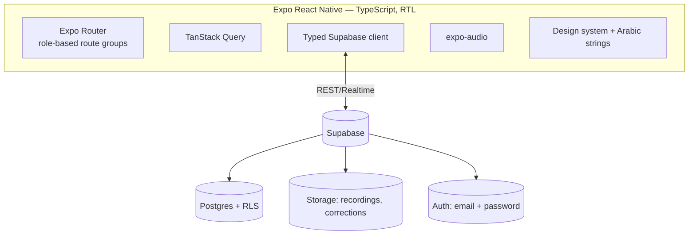
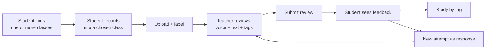
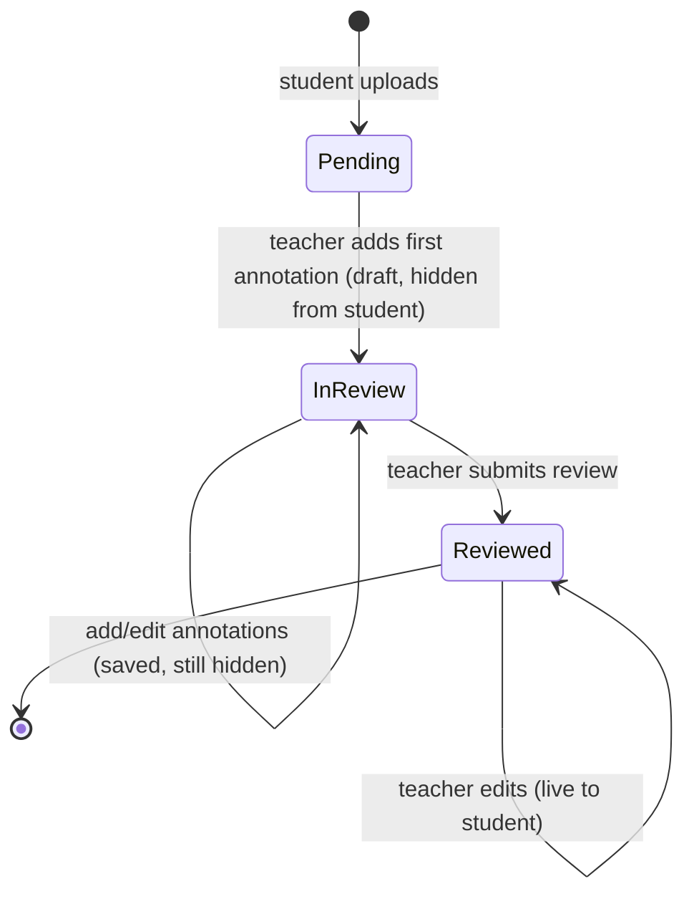

# منصة تعليم القرآن — Quran Learning Platform

An Arabic, right-to-left mobile app where **students record Quran recitations** and **teachers review them with timestamped annotations** — pinning a voice correction, a text comment, and tags to the exact moment of each mistake. Students consume feedback in context, filter their mistakes by tag to study weaknesses, and respond with new attempts that form a review thread.

> **Status:** Runs against a **self-hosted Supabase server** (default) so multiple phones share one backend — a teacher on one phone reviews a student's recording from another, in real time. The server runs locally on the dev PC via the Supabase CLI (Docker) and is seeded with **10 demo users + one class**. A fully on-device mode is kept behind a flag for single-phone testing. See `todo.md`.

## Backend modes
The data layer, auth, and file storage all switch on one flag:

```ts
// src/config/backend.ts
export const USE_LOCAL_BACKEND = false; // Supabase server (default — multi-device)
// = true → fully on-device (AsyncStorage + local accounts), single phone only
```

- **Supabase (default):** profiles, classes, recordings, annotations, tags, and audio live on a shared **server**; accounts + credentials are managed by Supabase Auth (hashed, server-side); audio is stored in private Storage buckets. Required for the **two-phone teacher/student simulation**. See "Local server setup" below.
- **On-device:** flip the flag to `true`; everything lives in AsyncStorage on one phone with no network. Useful for quick UI testing, but two phones can't see each other's data.

## Tech stack
- **Expo SDK 54** (React Native 0.81, React 19.1) + **TypeScript**, **Expo Router** (file-based routing) — matches the Expo Go SDK 54 client
- **Tajawal** font, forced **RTL** — all copy in `src/i18n/ar.ts` ✅
- **Supabase** — Postgres + Storage + Auth + RLS ✅ (auth wired in Phase 9)
- **TanStack Query** for server state ✅
- **expo-audio** for recording/playback *(added Phase 4)*

## Local server setup (self-hosted Supabase + two phones)
The server runs on the dev PC via the Supabase CLI (Docker). Phones reach it over Wi-Fi.

1. **Start + seed the server** (Docker must be running):
   ```bash
   ./server.sh          # supabase start + grants + seed 10 users & 1 class
   ```
   Studio is at `http://127.0.0.1:54323`. Stop later with `npx supabase stop`.
2. **Point the app at the server.** `.env` holds `EXPO_PUBLIC_SUPABASE_URL` (the PC's **LAN IP**, e.g. `http://192.168.1.213:54321`, so phones — not just `localhost` — can reach it) and the anon key. If the PC's IP changes, update `.env`.
3. **Open the firewall** so the phones can reach the PC on the API + Metro ports (`54321`, `8081`). On this Fedora box, inbound LAN is dropped by default — see "Networking" below.
4. **Run the app:** `./dev.sh --lan` (direct LAN, once the firewall is open) or `./dev.sh` (tunnel). Scan with Expo Go on each phone.
5. Log in as a **teacher** on one phone and a **student** on the other, then run the loop.

### Demo accounts (password `123456` for all)
Seeded by `server.sh`. The class **حلقة الإمام الشاطبي** (join code **`QRN-QRAN`**) is owned by أحمد with all 8 students already enrolled.

| Role | Email | Name |
|------|-------|------|
| 👨‍🏫 Teacher | `teacher1@quran.app` | الأستاذ أحمد |
| 👩‍🏫 Teacher | `teacher2@quran.app` | الأستاذة مريم |
| 👨‍🎓 Student | `student1@quran.app` | يوسف |
| 👩‍🎓 Student | `student2@quran.app` | فاطمة |
| 👨‍🎓 Student | `student3@quran.app` | عمر |
| 👩‍🎓 Student | `student4@quran.app` | عائشة |
| 👨‍🎓 Student | `student5@quran.app` | خالد |
| 👩‍🎓 Student | `student6@quran.app` | زينب |
| 👨‍🎓 Student | `student7@quran.app` | بلال |
| 👩‍🎓 Student | `student8@quran.app` | سمية |

> Auth is email + password (role chosen at signup; demo users pre-assigned). RLS is scoped to `auth.uid()` (migration `0002`): students see only their own + their class's data; teachers see only their own classes. Deploying to cloud Supabase later: run both migrations, set `.env` to the cloud URL/key, and run the seed against it.

### Networking (why `./dev.sh` defaults to tunnel)
This dev PC has many Docker bridge interfaces + Tailscale up. Two consequences: Expo mis-picks the host IP (fixed by `dev.sh`, which forces the real Wi-Fi IP), and inbound LAN traffic to the PC is dropped, so phones can't reach `54321`/`8081` directly until the firewall is opened. `./dev.sh` (tunnel) sidesteps both; `./dev.sh --lan` is faster once the firewall allows those ports.

## Architecture


## Core loop


**Classes (Google-Classroom style):** a student can join **multiple classes**, each owned by a different teacher; every recording is submitted into a specific class.

**Cross-device sync:** the backend is a shared server, so a teacher and student on two phones see each other's data. Queries refetch on app-focus and after a short stale window; a **reload button** in each screen header forces an immediate refresh on demand.

**Review ergonomics:** tapping **"add note"** while reviewing **auto-pauses** playback at the current moment, so the teacher pins a remark without manually stopping first.

## Recording review lifecycle


## Getting started (local mode — default)
```bash
npm install
./dev.sh               # tunnel mode — scan the QR with Expo Go on Android
```
`./dev.sh` defaults to **tunnel mode**. On some networks (and on the Linux dev box,
where Docker's firewall rules drop inbound LAN traffic) the phone cannot reach the
dev server directly — Expo Go gets stuck on a white screen with the blue loading
bar. Tunnel routes through Expo's relay and avoids that (needs internet on both
devices). If your LAN works, `./dev.sh --lan` is faster — it auto-detects and
forces the real Wi-Fi IP (Expo otherwise mis-picks a Docker/Tailscale interface).

No `.env` or backend needed. On the device, create a **teacher** account and a **student** account, then run the loop on the one phone. (For the Supabase backend instead, see "Backend modes" + "Supabase setup".)

## Project layout
```
app/        Expo Router routes (screens)
src/        config, theme, i18n, components, features, lib, types
assets/     icons & images
spec.md     approved v1 design (source of truth)
todo.md     phase-by-phase implementation plan
```
