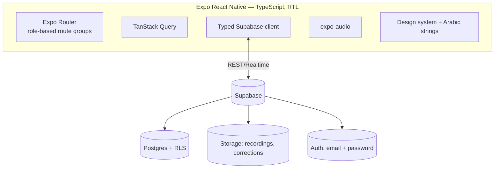
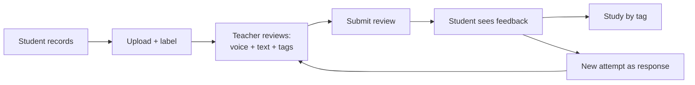

# منصة تعليم القرآن — Quran Learning Platform

An Arabic, right-to-left mobile app where **students record Quran recitations** and **teachers review them with timestamped annotations** — pinning a voice correction, a text comment, and tags to the exact moment of each mistake. Students consume feedback in context, filter their mistakes by tag to study weaknesses, and respond with new attempts that form a review thread.

> **Status:** Phase 4 complete — students record recitations (expo-audio, m4a), preview, label, and upload to Supabase Storage; recordings list on the student dashboard with status badges. Best tested on a physical device (microphone). Needs a Supabase project + `.env` (see setup below). See `todo.md`.

## Tech stack
- **Expo (React Native)** + **TypeScript**, **Expo Router** (file-based routing)
- **Tajawal** font, forced **RTL** — all copy in `src/i18n/ar.ts` ✅
- **Supabase** — Postgres + Storage + Auth + RLS ✅ (auth wired in Phase 9)
- **TanStack Query** for server state ✅
- **expo-audio** for recording/playback *(added Phase 4)*

## Supabase setup (Phase 2)
1. Create a project at [supabase.com](https://supabase.com).
2. In the dashboard SQL editor, run `supabase/migrations/0001_init.sql`.
3. `cp .env.example .env` and fill `EXPO_PUBLIC_SUPABASE_URL` + `EXPO_PUBLIC_SUPABASE_ANON_KEY` (Project Settings → API).
4. `npx expo start -c` and confirm the seeded Arabic tags load on the home screen.

> RLS in Phase 2 is **permissive for development** (no real auth yet) and is tightened to `auth.uid()` in Phase 9.

## Architecture


## Core loop


## Getting started
```bash
npm install
cp .env.example .env   # fill in Supabase keys from Phase 2 onward
npx expo start         # scan the QR code with Expo Go on Android
```

## Project layout
```
app/        Expo Router routes (screens)
src/        config, theme, i18n, components, features, lib, types
assets/     icons & images
spec.md     approved v1 design (source of truth)
todo.md     phase-by-phase implementation plan
```
