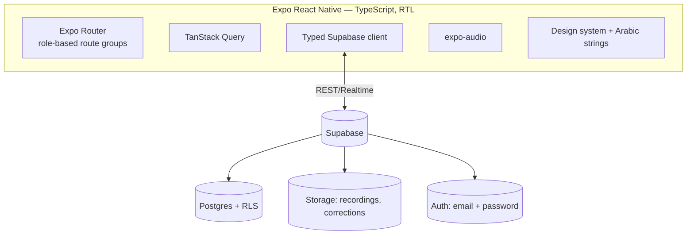
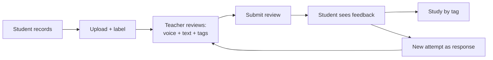
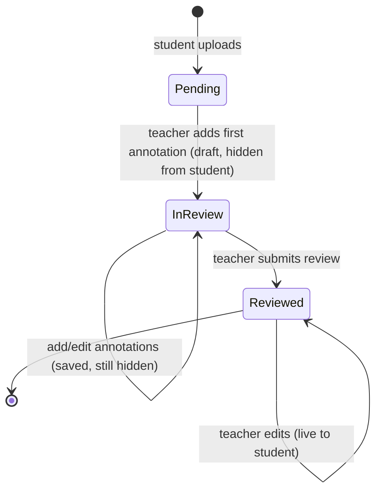

# منصة تعليم القرآن — Quran Learning Platform

An Arabic, right-to-left mobile app where **students record Quran recitations** and **teachers review them with timestamped annotations** — pinning a voice correction, a text comment, and tags to the exact moment of each mistake. Students consume feedback in context, filter their mistakes by tag to study weaknesses, and respond with new attempts that form a review thread.

> **Status:** Runs **fully on-device by default** (local storage + local accounts + local file storage) — no Supabase or `.env` needed. The Supabase backend is kept intact behind a flag (`src/config/backend.ts` → `USE_LOCAL_BACKEND`). Email+password auth with a role chosen at signup. Only the Android APK build (Phase 10) remains. Best tested on a physical device. See `todo.md`.

## Backend modes
The data layer, auth, and file storage all switch on one flag:

```ts
// src/config/backend.ts
export const USE_LOCAL_BACKEND = true;  // local-only (default)
// = false → use Supabase (run both migrations + set .env, see "Supabase setup")
```

- **Local (default):** profiles, classes, recordings, annotations, and tags live in AsyncStorage; audio files are copied into the app's document directory; accounts are stored on-device. Everything works on a single phone with no network. Teacher and student are separate **local accounts** that share the on-device data.
- **Supabase:** flip the flag to `false`, run the migrations, and fill `.env` (see below).

## Tech stack
- **Expo SDK 54** (React Native 0.81, React 19.1) + **TypeScript**, **Expo Router** (file-based routing) — matches the Expo Go SDK 54 client
- **Tajawal** font, forced **RTL** — all copy in `src/i18n/ar.ts` ✅
- **Supabase** — Postgres + Storage + Auth + RLS ✅ (auth wired in Phase 9)
- **TanStack Query** for server state ✅
- **expo-audio** for recording/playback *(added Phase 4)*

## Supabase setup
1. Create a project at [supabase.com](https://supabase.com).
2. In the dashboard SQL editor, run **both** migrations in order: `supabase/migrations/0001_init.sql` then `supabase/migrations/0002_auth_rls.sql`.
3. In **Authentication → Sign In / Providers → Email**, disable **"Confirm email"** (so sign-up returns a session immediately — fine for the prototype).
4. `cp .env.example .env` and fill `EXPO_PUBLIC_SUPABASE_URL` + `EXPO_PUBLIC_SUPABASE_ANON_KEY` (Project Settings → API).
5. `npx expo start -c`, sign up a **teacher** and a **student** account, and run the loop.

> Auth is email + password with a role chosen at signup. RLS is scoped to `auth.uid()` (migration `0002`): students see only their own + their class's data; teachers see only their own classes.

## Architecture


## Core loop


## Recording review lifecycle


## Getting started (local mode — default)
```bash
npm install
./dev.sh               # tunnel mode — scan the QR with Expo Go on Android
```
`./dev.sh` defaults to **tunnel mode**. On some networks (and on the Linux dev box,
where Docker's firewall rules drop inbound LAN traffic) the phone cannot reach the
dev server directly — Expo Go gets stuck on a white screen with the blue loading
bar. Tunnel routes through Expo's relay and avoids that (needs internet on both
devices). If your LAN works, `./dev.sh --lan` is faster — it auto-detects and
forces the real Wi-Fi IP (Expo otherwise mis-picks a Docker/Tailscale interface).

No `.env` or backend needed. On the device, create a **teacher** account and a **student** account, then run the loop on the one phone. (For the Supabase backend instead, see "Backend modes" + "Supabase setup".)

## Project layout
```
app/        Expo Router routes (screens)
src/        config, theme, i18n, components, features, lib, types
assets/     icons & images
spec.md     approved v1 design (source of truth)
todo.md     phase-by-phase implementation plan
```
