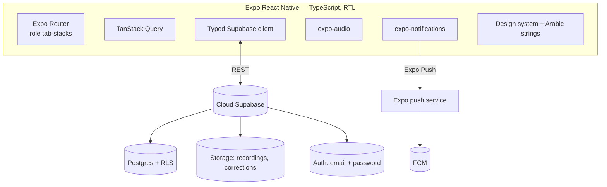
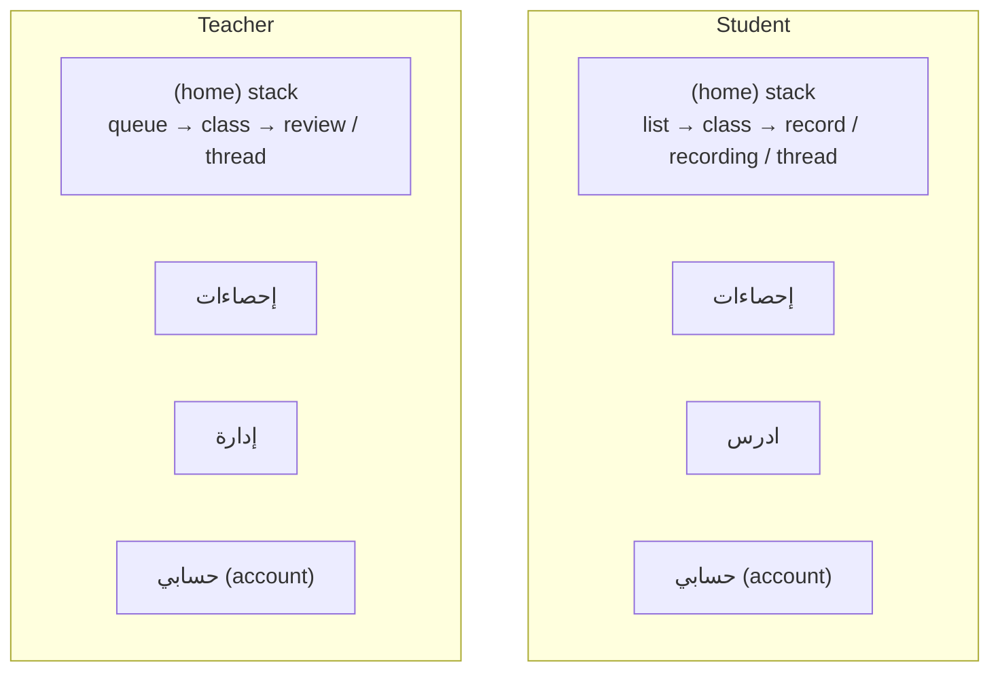
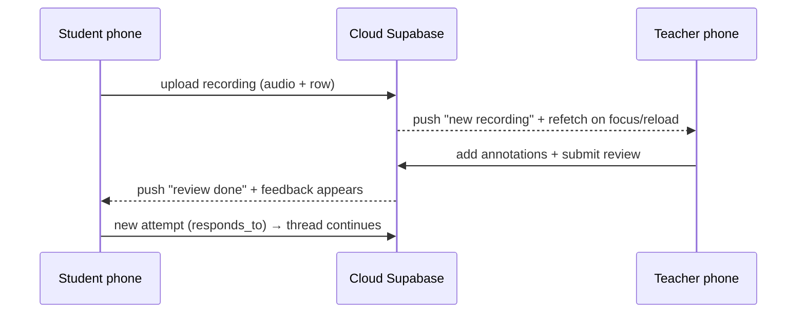
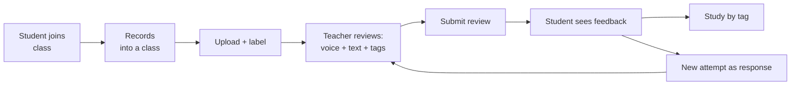
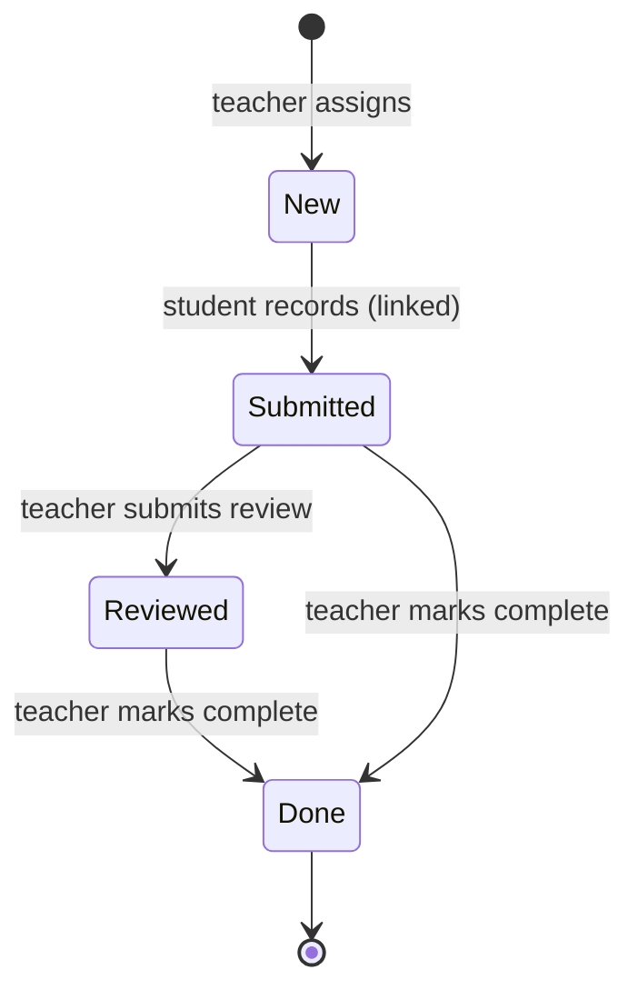
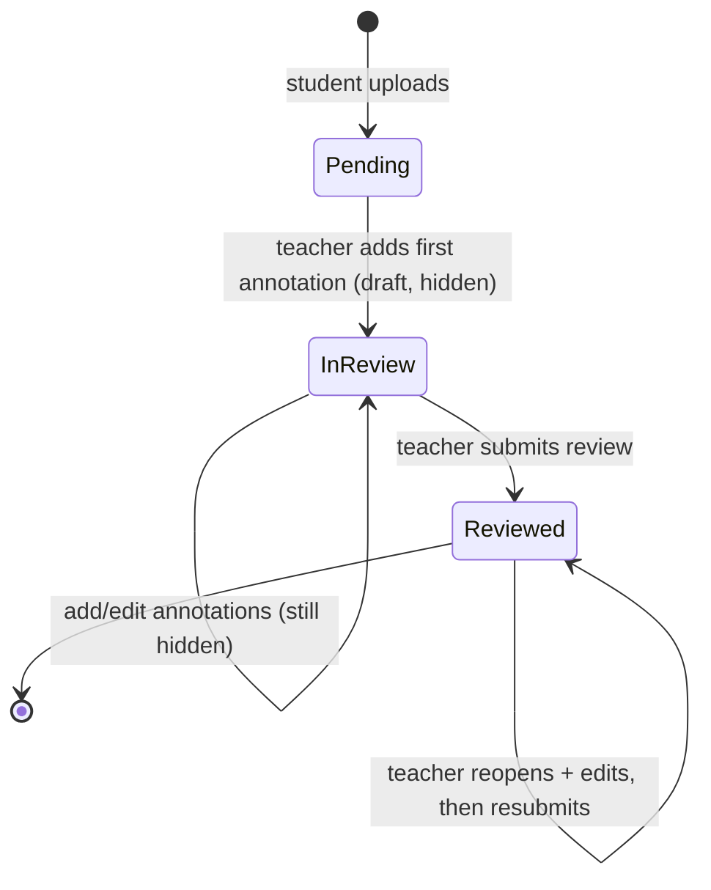

# صاحبك — Quran Learning Platform

An Arabic, right-to-left mobile app where **students record Quran recitations** and **teachers review them with timestamped annotations** — pinning a voice correction, a text comment, and tags to the exact moment of each mistake. Teachers also **assign wirds (أوراد)** — Quran portions to recite — and track each student's progress. Students consume feedback in context, filter their mistakes by tag, and respond with new attempts that form a review thread.

> ## ❤️ A charity project — free forever, never for profit
> This is built as a **sadaqah (صدقة جارية)** — for good deeds, not money. Under the
> [PolyForm Noncommercial License](LICENSE), **any commercial use is strictly not allowed**:
> no selling, no charging for access, no paywalls, and **no advertising or monetization** of any kind.
> Use it, fork it, improve it, and share it freely — for free. Keep it that way. 🤲

> **Status:** Runs against **cloud Supabase** (supabase.com) — Postgres + Storage + Auth + RLS — so phones share one backend over the internet (no same-Wi-Fi requirement). Distributed as an **installable Android APK** (`./build-apk.sh`). A fully on-device mode and a self-hosted local Supabase are kept as fallbacks behind flags/env. Source of truth: `spec.md`; plan: `todo.md`.

---

## Quick start

Prerequisites: **Node ≥ 20**, and either the **Expo Go** app (SDK 54) for dev, or **JDK 17** + Android SDK to build the APK.

### Develop (Expo Go)
```bash
npm install
./dev.sh            # tunnel (works anywhere) — or ./dev.sh --lan on the same Wi-Fi
```
`.env` points at the cloud project (`EXPO_PUBLIC_SUPABASE_URL` + anon key). Scan the QR with Expo Go. Note: push notifications **don't** deliver in Expo Go (needs the APK).

### Build the installable APK
```bash
./build-apk.sh      # JDK-17 release build → output/quran-latest.apk
adb install -r output/quran-latest.apk
```
The script re-syncs the native project (`expo prebuild`), forces a fresh JS bundle (so the current `.env` backend is embedded), prints the embedded Supabase host for verification, and copies the APK to `output/`. Works on any network since the backend is cloud `https`.

> First-time signup with test emails: in the Supabase dashboard, **Authentication → Sign In/Providers → Email → turn off "Confirm email"**, otherwise the session/profile insert fails.

---

## Backend modes

The data layer, auth, and file storage switch on one flag (`src/config/backend.ts`):

```ts
export const USE_LOCAL_BACKEND = false; // Supabase (default — cloud or self-hosted)
// = true → fully on-device (AsyncStorage + local accounts), single phone only
```

- **Supabase (default):** everything lives on the server; accounts via Supabase Auth (hashed, server-side); audio in private Storage buckets; access scoped by **RLS** (`auth.uid()`). The active project is set in `.env`.
  - **Cloud** (current): `EXPO_PUBLIC_SUPABASE_URL=https://<ref>.supabase.co`. Schema is managed via migrations applied through the Supabase MCP.
  - **Self-hosted (fallback):** a local Supabase on the dev PC; keep those values in `.env.local.bak` and swap them into `.env` to use them.
- **On-device:** flip the flag to `true` — everything in AsyncStorage on one phone, no network (single-device only).

---

## Tech stack

- **Expo SDK 54** (React Native 0.81, React 19.1) + **TypeScript**, **Expo Router** (file-based)
- **RTL** forced; all copy centralized in `src/i18n/ar.ts`
- Fonts: **Amiri** (UI, real 400/700 bold) + **Amiri Quran** (`variant="quran"`, for ayah text)
- **Supabase** — Postgres + Storage + Auth + RLS
- **TanStack Query** for server state; **expo-audio** for record/playback
- **expo-notifications** + Expo Push (FCM) for notifications; `react-native-svg` for charts/icons

---

## Architecture



### Navigation (bottom tabs, per-tab stacks)

Each role is a **bottom tab navigator**; the primary tab owns a **stack** so detail screens push full-screen while the tab bar stays visible. The old side drawer was replaced by the **حسابي (Account)** tab.



### How two devices stay in sync



---

## Core loop



**Multiple classes** (Google-Classroom style): a student joins many classes, each owned by a different teacher; every recording targets one class. Tapping **"add note"** while reviewing **auto-pauses** playback at that moment. Each role has a **stats dashboard** (coverage, most-recited surahs, mistakes by surah/tag).

---

## Wird (أوراد) — teacher-assigned tasks

A teacher assigns a Quran portion (whole class or a single student) with an optional title, note, and due date; the student records it (pre-filled & linked); the teacher reviews and **manually marks it complete per student**. See `spec.md` §11.



Status labels in-app: `جديد → بانتظار المراجعة → تمت المراجعة → مكتمل`; overdue wirds show a `متأخر` badge. Teachers manage wirds from the class screen; students see and record them from the class screen.

---

## Recording review lifecycle



---

## Notifications

On login the device's Expo push token is saved to `profiles.expo_push_token`. Pushes fire on: **review submitted** → student, **new recording** → teacher, **annotation reply** → the other party, and **wird assigned** → student(s). Each event is also written to a **`notifications` table** powering an in-app **notification center** (bell + unread badge + app-icon badge), and tapping a recording notification **deep-links** to it.

> Delivery needs the **APK** (not Expo Go) with **FCM credentials** configured via EAS + a custom sound (`assets/quran_app_notif.mp3`). Sending is currently client-side; production should move it to a Supabase **Edge Function**.

---

## Design & branding

Identity from the *mushaf*: **emerald** (`#0E5E4E`) + **gold** (`#C9A227`) on parchment (light) / **warm charcoal** (dark); **Amiri** Arabic type with a thin gold rule + diamond under each header. Light/dark palettes live in `src/theme/colors.ts` (via `ThemeProvider` + `useColors()`), toggled from the **Account** tab and persisted.

- **Ayah/page picker** (`AyahPicker`): pick **by ayah** (surah → ayah, capped, cross-surah ranges) or **by page** (1–604), Latin numerals; fills the recording/wird label (still editable).
- **Recording UI:** a pulsing `RecordingOrb` while live; recitations cap at 5 min, voice corrections at 2 min.
- **Annotations:** point **or range** (`end_ms`), per-annotation **replies + resolve**, visible markers on the seek bar with a "go to" jump.
- **Account tab:** profile (name / email / WhatsApp), dark-mode toggle, logout.
- **Teacher:** rename/delete class, remove students, copy join code, reopen-to-edit a submitted review.
- **App icon & splash** generated from `assets/logo.svg` (emerald `#01443A`).

---

## Contributing

Contributions are welcome! Please:
1. Read **[`CONTRIBUTING.md`](CONTRIBUTING.md)** — it covers setting up **your own** Supabase project
   (create one, apply `supabase/migrations/`, fill `.env`), running the app, and the PR workflow.
2. Skim **[`docs/ARCHITECTURE.md`](docs/ARCHITECTURE.md)** for the design, data model, and screen map.
3. Before a PR: `npx tsc --noEmit` and `npx expo export --platform android` must pass (CI enforces this).

By participating you agree to the [Code of Conduct](CODE_OF_CONDUCT.md) and that your contributions
are released under the project's [PolyForm Noncommercial License](LICENSE) — i.e. **non-commercial use
only** (no selling, paywalls, or ads). Report vulnerabilities privately per [`SECURITY.md`](SECURITY.md).

> The `.env` in this repo (gitignored) points at the maintainer's backend — contributors run against
> their **own** Supabase project, so you don't need any of the maintainer's keys.

## Project layout

```
app/
  (auth)/                  sign-in / sign-up
  (student)/               role tab navigator
    (home)/                home stack: index, class, record, recording, thread
    dashboard / study / more
  (teacher)/               role tab navigator
    (home)/                home stack: index, class, review, thread
    dashboard / manage-class / more
  notifications.tsx, profile.tsx
src/
  config/ theme/ i18n/ components/ lib/ types/
  features/  session, classes, recordings, annotations, tags, wirds, notifications, account, stats
supabase/migrations/       SQL schema + RLS (applied to cloud via the Supabase MCP)
build-apk.sh               JDK-17 release build → output/
spec.md / todo.md          design + plan (gitignored)
```
