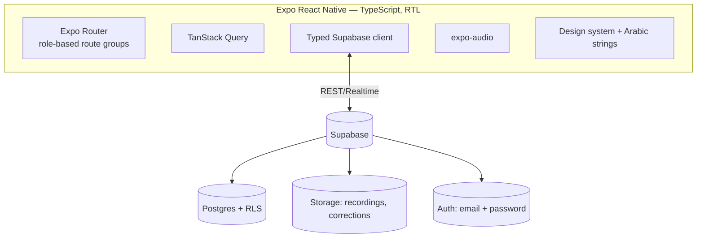
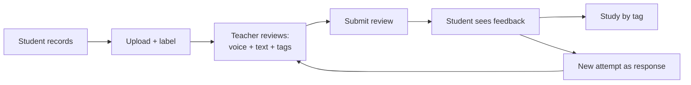

# منصة تعليم القرآن — Quran Learning Platform

An Arabic, right-to-left mobile app where **students record Quran recitations** and **teachers review them with timestamped annotations** — pinning a voice correction, a text comment, and tags to the exact moment of each mistake. Students consume feedback in context, filter their mistakes by tag to study weaknesses, and respond with new attempts that form a review thread.

> **Status:** Phase 0 complete — Expo + TypeScript + Expo Router scaffold runs on Android (Expo Go). See `todo.md` for the phase plan.

## Tech stack
- **Expo (React Native)** + **TypeScript**, **Expo Router** (file-based routing)
- **Supabase** — Postgres + Storage + Auth + RLS *(added Phase 2)*
- **TanStack Query** for server state *(added Phase 2)*
- **expo-audio** for recording/playback *(added Phase 4)*
- **Tajawal** font, forced **RTL** *(added Phase 1)*

## Architecture


## Core loop


## Getting started
```bash
npm install
cp .env.example .env   # fill in Supabase keys from Phase 2 onward
npx expo start         # scan the QR code with Expo Go on Android
```

## Project layout
```
app/        Expo Router routes (screens)
src/        config, theme, i18n, components, features, lib, types
assets/     icons & images
spec.md     approved v1 design (source of truth)
todo.md     phase-by-phase implementation plan
```
