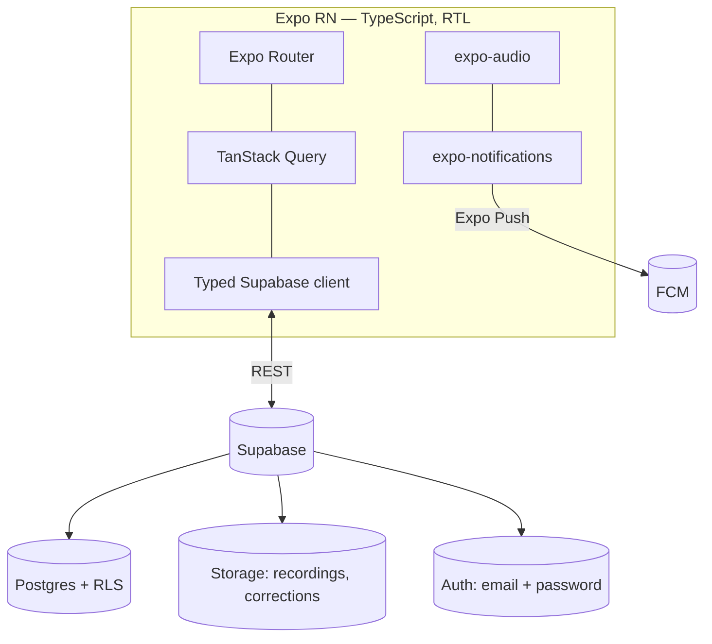
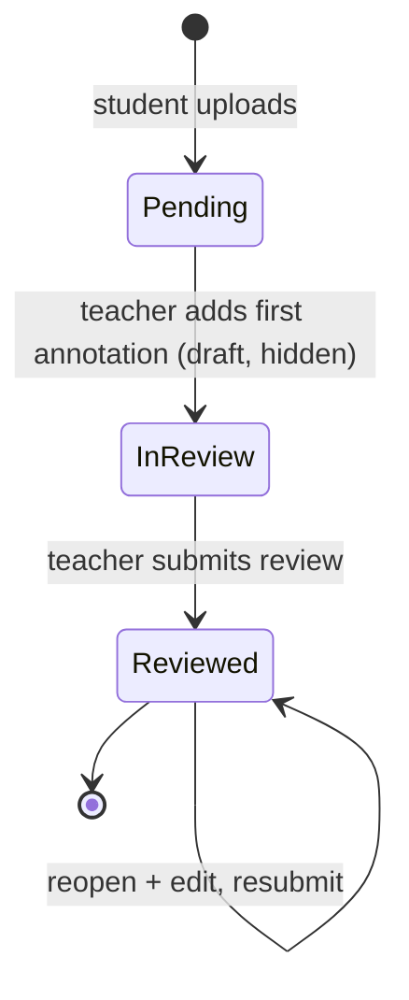
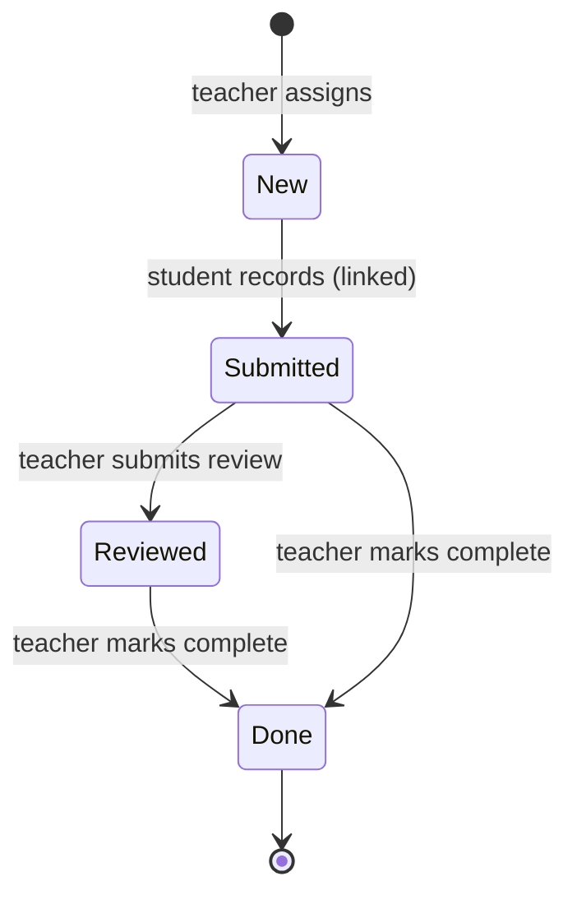

# Architecture

A public overview of how صاحبك is built, for contributors. (Day-to-day setup is in
[`CONTRIBUTING.md`](../CONTRIBUTING.md); user-facing intro is in [`README.md`](../README.md).)

## Overview
An Arabic, RTL Expo (React Native) app on a Supabase backend. Students record Quran recitations into
classes; teachers review with timestamped voice/text/tag annotations and assign **wirds** (Quran
portions); feedback flows back, and re-attempts form threads.

## Stack
- **Expo SDK 54** (RN 0.81, React 19), **TypeScript**, **Expo Router** (file-based, role tab-stacks)
- **Supabase** — Postgres + Storage + Auth + **RLS**
- **TanStack Query** (server state), **expo-audio** (record/playback), **expo-notifications** (push)
- **react-native-svg** (icons/charts), **Amiri** UI font + **Amiri Quran** for ayah text
- Forced **RTL**; all copy in `src/i18n/ar.ts` (no hardcoded UI strings)



## Data model
Tables (all RLS-protected; see `supabase/migrations/`):
- **profiles** — `id (= auth.users.id)`, `full_name`, `role`, `whatsapp`, `expo_push_token`
- **classes** — `teacher_id`, `name`, `join_code`
- **class_members** — `class_id`, `student_id` (a student can join many classes)
- **recordings** — `class_id`, `student_id`, `label`, `audio_path`, `status` (`pending`/`in_review`/`reviewed`), `responds_to_id` (threads), structured ref columns, `wird_id`
- **annotations** — `recording_id`, `teacher_id`, `timestamp_ms`, optional `end_ms` (range), `resolved`, `comment_text`, `voice_path`
- **annotation_tags** / **tags** — Tajweed mistake tags (seeded + custom)
- **annotation_replies** — per-annotation conversation
- **notifications** — durable feed powering the in-app notification center
- **wirds** — assigned tasks (`class_id`, nullable `student_id`, portion ref, `title`, `note`, `due_at`)
- **wird_completions** — per-student teacher-marked completion

**RLS principle:** students see only their own data + their classes' shared data; teachers see only
their own classes. Storage buckets `recordings`/`corrections` are private (signed URLs).

## Navigation
Each role is a **bottom-tab navigator**; the primary tab owns a **stack**, so detail screens push
full-screen while the tab bar stays visible.
- **Student:** `(home)` (list → class → record / recording / thread) · إحصاءات · ادرس · حسابي
- **Teacher:** `(home)` (queue → class → review / thread) · إحصاءات · إدارة · حسابي

## Key flows

### Recording review lifecycle


### Wird lifecycle (per student)


## Code layout
```
app/                         Expo Router routes (role tab-stacks, auth, notifications, profile)
src/config                   backend flag, env, typed Supabase client
src/theme                    colors (light/dark), typography, spacing, tab-bar config
src/i18n/ar.ts               all Arabic strings
src/components               Screen, Card, Button, Player, AyahPicker, Charts, TabBarIcon, ...
src/features                 session, classes, recordings, annotations, tags, wirds,
                             notifications, account, stats  (api hooks + UI per domain)
src/lib                      audio + datetime helpers
src/types/database.ts        hand-written DB types
supabase/migrations          SQL schema + RLS
```

## Notes
- Schema changes are **new** migration files (never edit applied ones); add RLS for new tables.
- The data layer can also run fully on-device (`USE_LOCAL_BACKEND = true`) for single-phone UI testing.
